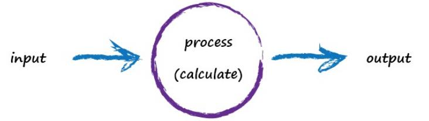

# A Simple Perdicting Machine

[toc]

## Human Model

## Computer Model

Computers don't really think, they're just glorified calculators remember.

A computer takes some input, does some calculation and pops out an output.

## Example : Kilometers to Miles

- Try a model which is linear

- Pluck a constant value at random.

 error = truth - calculated = 62.137 - 50 = 12.137

Set c to 0.6 : miles = kilometers * c = 100 * 6 = 60

error = 62.137 - 60 = 2.137 (more better)

The important point here is that we used the error to guide how we nudged the value of c.

We wanted to increase the output from 50 so we increased c a little bit.

Rather than try to use algebra to work out the exact amount c needs to change.

We’ve gone too far and overshot the known correct answer. 

Our previous error was 2.137 but now it’s -7.863. 

The minus sign simply says we overshot rather than undershot, remember the error is (correct value - calculated value).

Ok so c = 0.6 was way better than c = 0.7. 

We could be happy with the small error from c = 0.6 and end this exercise now. 

But let’s go on for just a bit longer. 

Why don’t we nudge c up by just a tiny amount, from 0.6 to 0.61

So that last effort taught us that we should moderate how much we nudge the value of c. If the outputs are getting close to the correct answer - that is, the error is getting smaller - then don’t nudge the changeable bit so much. That way we avoid overshooting the right value, like we did earlier.

Again without getting too distracted by exact ways of working out c, and to remain focused on this idea of successively refining it, we could suggest that the correction is a fraction of the error. That’s intuitively right - a big error means a bigger correction is needed, and a tiny error means we need the teeniest of nudges to c.

What we’ve just done, believe it or not, is walked through the very core process of learning in a neural network - we’ve trained the machine to get better and better at giving the right answer.

It is worth pausing to reflect on that - we’ve not solved a problem exactly in one step, like we often do in school maths or science problems. Instead,we’ve taken a very different approach by trying an answer and improving it repeatedly. Some use the term iterative and it means repeatedly improving an answer bit by bit.

>Key Points:
>
>   -	All useful computer systems have an input, and an output, with some kind of calculation in between. Neural networks are no different.
>
>   -	When we don't know exactly how something works we can try to estimate it with a model which includes parameters which we can adjust. If we didn't know how to convert kilometers  to miles, we might use a linear function as a model,with an adjustable gradient.
>
>   -	A good way of refining these models is to adjust the parameters based on how wrong the model is compared to known true examples.

## Summary

- model (formula) : miles = kilometers * c

- adjust parameter : c

- error = correct value - calculated value

- target = collected data value

- actual = calculated value depended on a formula

- Don't know how something works exactly? 

  Try a model with adjustable parameters.

- Use the error to refine the parameters.