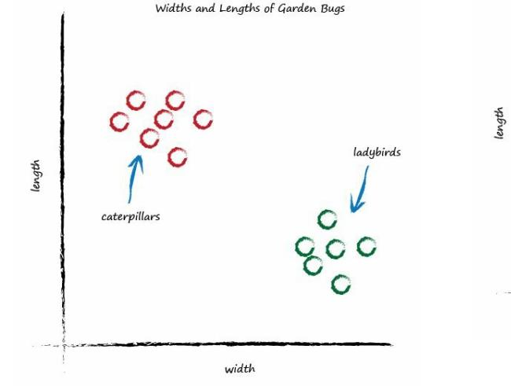
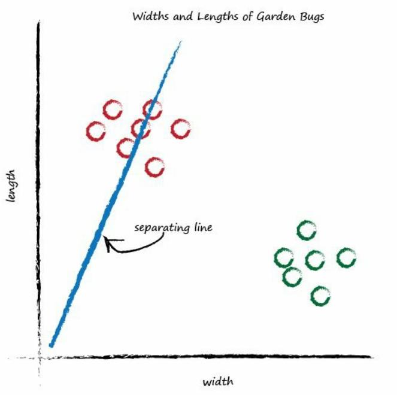
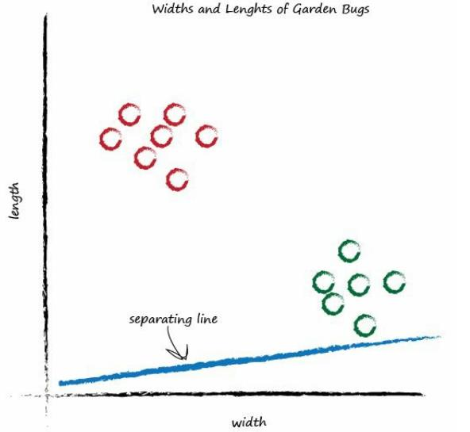
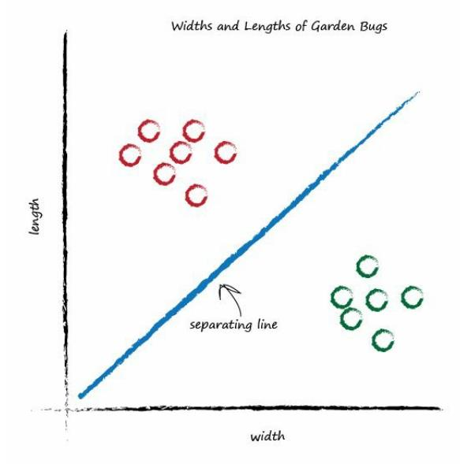
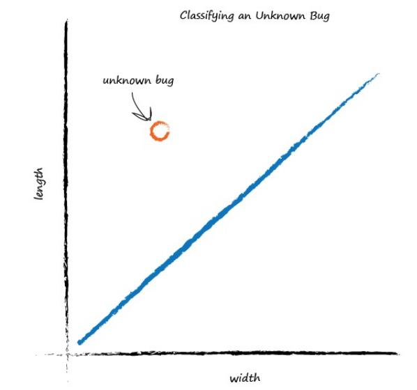

# 3rd.Classifying is not very different from Predicting

[toc]

## Predictor

Above simple machine is called the **predictor**, because it takes an input and makes a prediction of what the output should be.

We refined that prediction by adjusting an internal parameter, informed by the error we saw when comparing with a known-true example.

## Separating Line

### Graph showing the measured width and lengths of garden bugs.

It is divided into two groups:

- caterpillars : thin and long

- ladybirds : wide and short

  

> Think the predictor that tried to work out the correct number of miles given kilometers. 
>
> That predictor had an adjustable linear function at it’s heart. 
>
> Remember, linear functions give straight lines when you plot their output against input. 
>
> The adjustable parameter c changed the slope of that straight line.

### Place a straight line over the plot

Use the line to separate different kinds of things.

If the line was dividing the caterpillars from the ladybirds,then it could be used to classify an unknown bug based on its measurements.

- Case 1 :

​	The line above doesn’t do this yet because half the caterpillars are on the same side of the dividing line as the ladybirds.

- Case 2 :

​	This time the line is even less useful! 

​	It doesn’t separate the two kinds of bugs at all.

- Case 3 :

That's much better! 

This line neatly separates caterpillars from ladybirds.

We can now use this line as a **classifier** of bugs.

### Classifying an Unknown Bug

Assuming that there are no other kinds of bugs that we haven't seen.

We're simply trying to illustrate the idea of a simple classifier.

We've seen how a linear function inside our simple predictors can be used to classify previously unseen data.

But we’ve skipped over a crucial element. How do we get the right slope? How do we improve a line we know isn’t a good divider between the two kinds of bugs?

The answer to that is again at the very heart of how neural networks learn,and we’ll look at this next.

>Key Points
>
>- **Classifying** things is kind of like **predicting** things.

