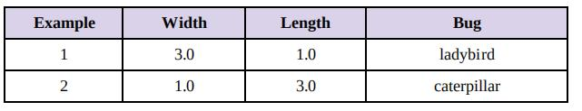
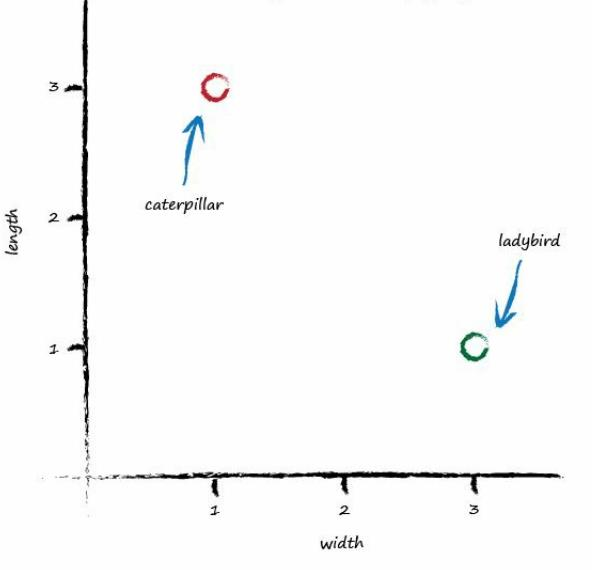
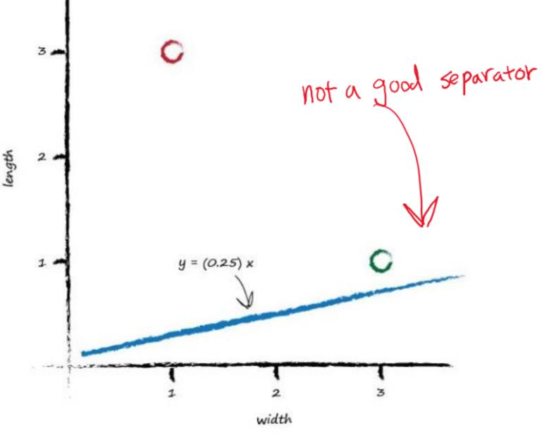
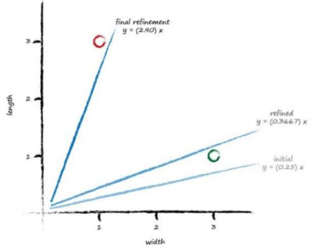
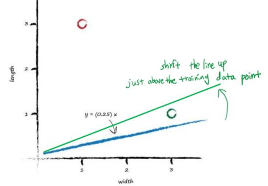
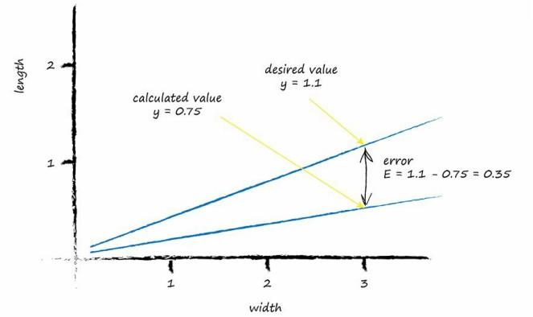
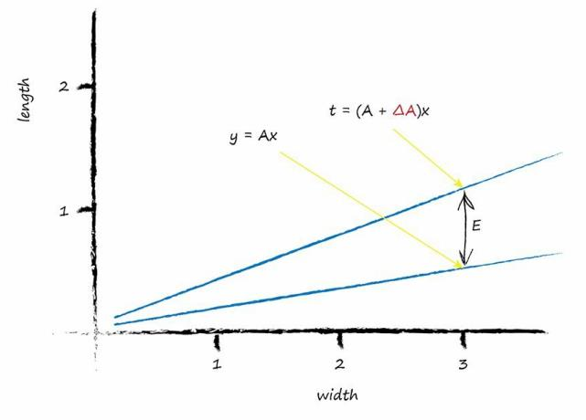
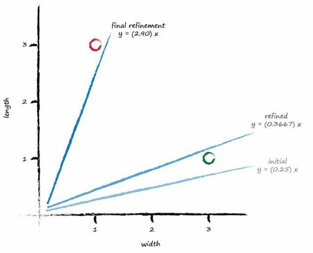
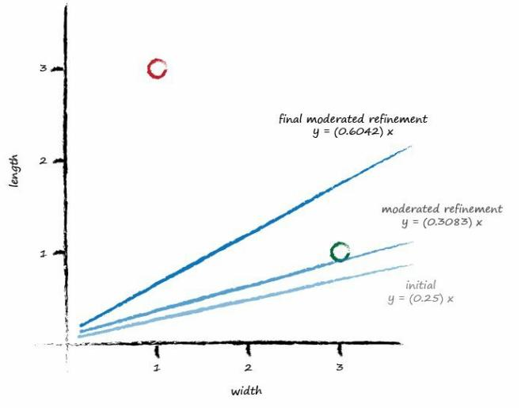

# Training a Simple Classifier

[toc]

## **1. Target** 

To train our linear classifier to correctly classify bugs as ladybirds or caterpillars.

We saw above this is simply about refining the slope of the dividing line that separates the two groups of points on a plot of big width and height.

## **2. Training Data**

his is a set of examples which we know to be the truth.

It is these examples which will help refine the slope of the classifier function.

Examples of truth used to teach a predictor or a classifier are called the **training data.**

## **3. Learning from Data**

Start with a random dividing line, just to get started somewhere.
$$
y = Ax
$$

>We've deliberately used the names **y** and **x** instead of length and width,because strictly speaking,the line is not a predictor here. It doesn't convert width to length,like we previously converted miles to kilometers. Instead,it is a dividing line,a classifier.
>
>Notice that this **y = Ax** is simpler than the fuller form for a straight line **y = Ax + B**. We’ve deliberately kept this garden bug scenario as simple as possible. Having a non-zero **B** simple means the line doesn’t go through the origin of the graph, which doesn't add anything useful to our scenario.

The parameter **A** controls the slope of the line. The larger **A** is the larger the slope.

Let's go for **A** is 0.25 to get started. Then the dividing line is **y = 0.25x.**

The line **y = 0.25x** isn’t a good classifier already without the need to do any calculations. 

The line doesn’t divide the two types of bug.

So intuitively we need to move the line up a bit. We’ll resist the temptation to do this by looking at the plot and drawing a suitable line. We want to see if we can find a repeatable recipe to do this, a series of computer instructions, which computer scientists call an algorithm.

Look at the first training example : 

- a ladybird : width(x) = 3.0, length(y) = 1.0

- y = Ax

> **A = 0.25**
>
>  **y = (0.25) \* (3.0) = 0.75**

So we have a difference, an **error**. Just as before, with the miles to kilometers predictor, we can use this error to inform how we **adjust the parameter A**. 

Before we do,let’s think about what y should be again. If y was 1.0 then the line goes right through the point where the ladybird sits at (x,y) = (3.0,1.0). It’s a subtle point but we don’t actually want that. We want the line to go above that point. Why? Because we want all the ladybird points to be below the line, not on it. The line needs to be a dividing line between ladybirds and caterpillars, not a predictor of a bug’s length given its width.

So let’s try to aim for y = 1.1 when x = 3.0. It’s just a small number above 1.0,we could have chosen 1.2, or even 1.3, but we don’t want a larger number like 10 or 100 because that would make it more likely that the line goes above both ladybirds and caterpillars, resulting in a separator that wasn’t useful at all.

****

So the desired target is 1.1, and the error is E = 1.1 - 0.75 = 0.35.

** error = (desired target - actual output) **

## **4. Use Error to Guide a Better Refined Parameter A**

What do we do with this E to guide us to a better refined parameter A?

>  **Let's take a step back from this task and think again.**
>
> **We want to use the error in y, which we call E, to inform the required change in parameter A.**
>
> **To do this we need to know how the two are related.**
>
> **How is A related to E?**
>
> **If we can know this,then we can understand how changing one affects the other.**

The linear function for the classifier:
$$
y = Ax
$$

> We know that for initial guesses of A this gives the wrong answer for y, which should be the value given by the training data.
>
> Let's call the correct desired value, t for target value.

define :

- **target value(t)** : the correct desired value

To get that value t, we need to adjust A by a small amount.

Mathematicians use the delta symbol Δ to mean "a small change in".
$$
t = (A + ΔA)x
$$

$$
\begin{align}
E & = desired \quad correct\quad value\quad -\quad calculated\quad value\quad based\quad on\quad current\quad guess\quad for\quad A \\
          & = t - y \\
  	  & = (A + ΔA)x - Ax\\
  	  & = (ΔA)x \\
\end {align}
$$

The error E is related to ΔA is very simple way.

​																 E = **ΔAx** 

>  Remind ourselves of what we wanted to get out of all this:
>
> We wanted to **know how much to adjust A by to improve the slope of the line so it is a better classifier, being informed by the error E.**

​																	 **ΔA = E/x**

That's the magic expression we've been looking for.

We can use the error **E** to refine the slope **A** of the classifying line by an amount **ΔA.**

## **5. Update the initial Slope**

- The error = 0.35, x = 3.0, then  ΔA = E/x = 0.35/3.0 = 0.1167 and A = 0.25 

  so new A = (A + ΔA) = 0.25 + 0.1167 = 0.3667.

  Then the calculated value of y with this new A is 1.1 as you'd expect - it's the desired target value.

Next true training data pairing of x  = 1.0 and y = 3.0.Put x = 1.0 into the linear function which is now using the updated A = 0.3667.y = 0.3667 * 1.0 = 0.3667.That's not very close to the training example with y = 3.0 at all.

Using the same reasoning as before that we want the line to not cross the training data but instead be just above or below it, we can set the desired target value at 2.9.This way the training example of a caterpillar is just above the line, not on it. The error E is (2.9 - 0.3667) = 2.5333.

> That’s a bigger error than before, but if you think about it, all we’ve had so far for the linear function to learn from is a single training example, which clearly biases the line towards that single example.

Update the A again:

- ΔA = E/x = 2.5333 / 1.0 = 2.5333.

  New A = 0.3667 + 2.5333 = 2.9.

  That means for x = 1.0 the function gives 2.9 as the answer,which is what the

  desired value was.

Result picture:

Wait! What’s happened! Looking at that plot, we don’t seem to have improved the slope in the way we had hoped. It hasn’t divided neatly the region between ladybirds and caterpillars.

Well, we got what we asked for. The line updates to give each desired value for y.

What's wrong with that? 

Well, if we keep doing this, updating for each training data example, all we get is that the final update simply matches the last training example closely. We might as well have not bothered with all previous training examples. In effect we are throwing away any learning that previous training examples might gives us and just learning from the last one.

## **6. Fix the Previous Problem**

How to fix the previous problem?

> Easy! And this is an important idea in **machine learning**.
>
> **We moderate the updates. That is, we calm them down a bit. Instead of jumping enthusiastically to each new A, we take a fraction of the change ΔA, not all of it. This way we move in the direction that the training example suggests, but do so slightly cautiously, keeping some of the previous value which was arrived at through potentially many previous training iterations. We saw this idea of moderating our refinements before - with the simpler miles to kilometers predictor, where we nudged the parameter c as a fraction of the actual error.**
>
> This moderation, has another very powerful and useful side effect. When the training data itself can’t be trusted to be perfectly true, and contains errors or noise, both of which are normal in real world measurements, the moderation can dampen the impact of those errors or noise. It smooths them out.

Add a moderation into the update formula:
$$
ΔA = L (E / x )\\

L \ :\ learning\quad rate\quad (moderating\quad factor)
$$
Pick L = 0.5 as a reasonable fraction just to get started.

It simply means we only update half as much as would have done without moderation.

- The first training data :

  An initial A = 0.25, the desired value = 1.1. 

  The first training example gives us y = 0.25 * 3.0 = 0.75.

  So E = 1.1 - 0.75 = 0.35.

  Then ΔA = L (E / x) = 0.5 * 0.35 / 3.0 = 0.0583.

  The updated A = 0.25 + 0.0583 = 0.3083.

  Trying out this new A on the training example at x = 3.0 gives y = 0.3083 * 3.0 = 0.0250.

The line now falls on the wrong side of the training example because it is below 1.1 but it’s not a bad result if you consider it a first refinement step of many to come. It did move in the right direction away from the initial line

- Press on to the second training data:

   Using A = 0.3083 ，x = 1.0, then y = 0.3083 * 1.0 = 0.3083. 

  The desired value = 0.9. 

  So the error = 0.9 - 0.3083 = 0.5917. 

  The ΔA = L (E / x) = 0.5 * 0.5917 / 1.0 = 0.2958. 

  The even newer A = 0.3083 + 0.2958 = 0.6042.

Visualise again the initial,improved and final line:

This is really good!

Even with these two simple training examples, and a relatively simple update method using a moderating learning rate, we have very rapidly arrived at a good dividing line y = Ax where A is 0.6042.

Let’s not diminish what we’ve achieved. We’ve achieved an automated method of learning to classify from examples that is remarkably effective given the simplicity of the approach.

Brilliant!

## **7.Key Points**

- We can use simple maths to understand the relationship between the output error of a linear classifier and the adjustable slope parameter. That is the same as knowing how much to adjust the slope to remove that output error.

-  A problem with doing these adjustments naively, is that the model is updated to best match the last training example only, discarding all previous training examples. A good way to fix this is to moderate the updates with a learning rate so no single training example totally dominates the learning.

- Training examples from the real world can be noisy or contain errors. Moderating updates in this way helpfully limits the impact of these false examples.

- Moderating your learning is good - ensures you learn from all your data, and reduces impact of outlies or noisy training data.