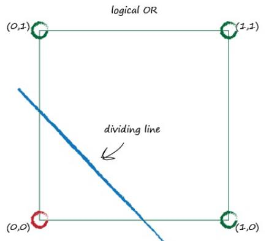

# Sometimes One Classifier Is Not Enough

[toc]

## **1. Boolean Logic Functions**

Boolean logic functions are like language or thought functions:

Boolean logical functions typically take two inputs and output one answer:

Computers often represent **true** as the number **1**, and **false** as the number **0**.

AND : only ture if both A and B are true.

OR : ture whenever any of the inputs A or B is ture.

##**2. Logical Function Dividing Line**

Look at the following plot, showing the two inputs A and B to the logical

function as coordinates on a graph. 

### **Logical AND Dividing Line**

The plot shows that only when both are true, with value 1, is the output also true, shown as green. False outputs are shown red.

 

A straight line that divides the red from the green regions. 

That line is a linear function that a linear classifier could learn, just as we have done earlier.

We won’t go through the numerical workings out as we did before because they’re not fundamentally different in this example.

In fact there are many variations on this dividing line that would work just as well, but the main point is that it is indeed possible for a simple linear classifier of the form **y = ax+b** to learn the Boolean **AND** function.

### **Logical OR Dividing Line**

This time only the (0,0) point is red because it corresponds to both inputs A

and B being false. All other combinations have at least one A or B as true,and so the output is true. 

The beauty of the diagram is that it makes clear that it is possible for a linear classifier to learn the Boolean OR function, too.

## **2. XOR**

XOR(eXclusive OR) which only has a true output if either one of the inputs A or B is true, but not both. 

That is, when the inputs are both false, or both true, the output is false.

It is impossible to have a single straight line that successfully divides

the red from the green regions for the Boolean XOR. 

That is, a simple linear classifier can’t learn the Boolean XOR if presented with training data that was governed by the XOR function.

## **3. Limitation of the simple linear classifier**

We’ve just illustrated a major limitation of the simple linear classifier. A simple linear classifier is not useful if the underlying problem is not separable by a straight line.

We want neural networks to be useful for the many many tasks where the underlying problem is not linearly separable - where a single straight line doesn’t help.

Luckily the fix is easy. In fact the diagram below which has two straight lines to separate out the different regions suggests the fix - we use multiple classifiers working together. That’s an idea central to neural networks. You can imagine already that many linear lines can start to separate off even unusually shaped regions for classification.

## **4. Key Points**

- A simple linear classifier can’t separate data where that data itself isn’t governed by a single linear process. For example, data governed by the logical XOR operator illustrates this.

- However the solution is easy, you just use multiple linear classifiers to divide up data that can’t be separated by a single straight dividing line.

- Some problems can't be solved with just a single simple linear classifier.

- You can use multiple nodes working together to solve many of these problems.