# Neurons, Nature's Computing Machines

[toc]

## **1. Neuron**

- the basic unit of a biological brain

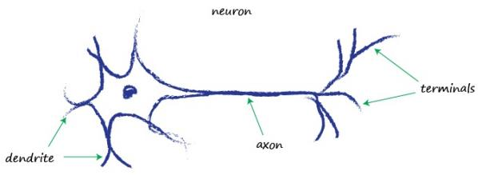

Neurons, although there are various forms of them, all transmit an electrical signal from one end to the other, from the dendrites along the axons to the terminals. These signals are then passed from one neuron to another. This is how your body senses light, sound, touch pressure, heat and so on. Signals from specialised sensory neurons are transmitted along your nervous system to your brain, which itself is mostly made of neurons too.

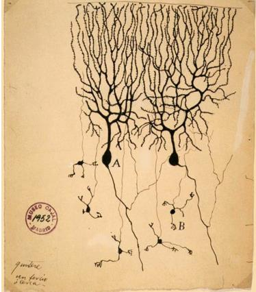

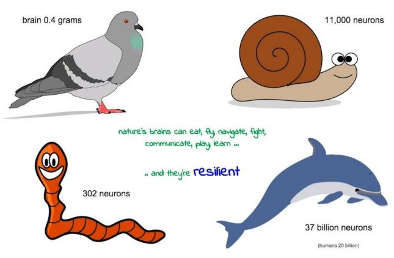

## **2. How a Neuron Works?**

It takes an electric input, and pops out another electrical signal. This looks exactly like the classifying or predicting machines we looked at earlier, which took an input, did some processing, and popped out an output.

So could we represent neurons as linear functions, just like we did before? Good idea, but no. A biological neuron doesn’t produce an output that is simply a simple linear function of the input. That is, its output does not take the form output = (constant * input) + (maybe another constant).

Observations suggest that neurons don’t react readily, but instead suppress the input until it has grown so large that it triggers an output. You can think of this as a threshold that must be reached before any output is produced. It’s like water in a cup - the water doesn’t spill over until it has first filled the cup. Intuitively this makes sense - the neurons don’t want to be passing on tiny noise signals, only emphatically strong intentional signals. The following illustrates this idea of only producing an output signal if the input is sufficiently dialed up to pass a threshold.

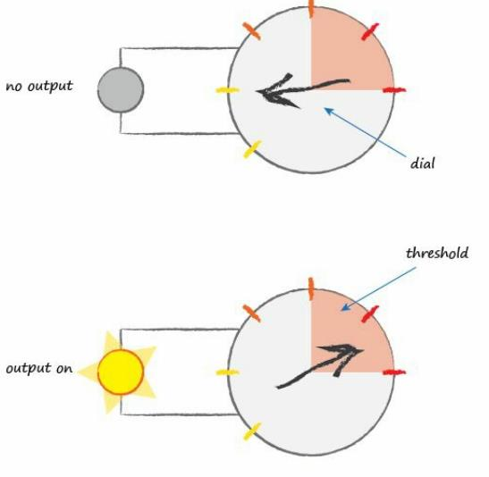

A function that takes the input signal and generates an output signal, but takes into account some kind of threshold is called an **activation function**. 

Mathematically, there are many such activation functions that could achieve this effect. 

## **3. Step Function**

A simple **step function** could do this:

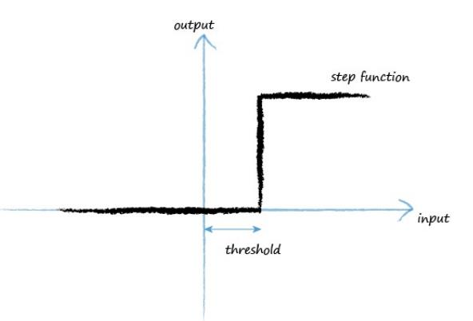

For low input values, the output is zero. However once the threshold input is reached, output jumps up. 

An artificial neuron behaving like this would be like a real biological neuron. The term used by scientists actually describes this well, they say that neurons **fire** when the input reaches the threshold.

## **4. Sigmoid function(Logistic Function)**

Improve on the step function.

The S-shaped function shown below is called the **sigmoid function**. 

**It is smoother than the cold hard step function, and this makes it more natural and realistic.** 

Nature rarely has cold hard edges!

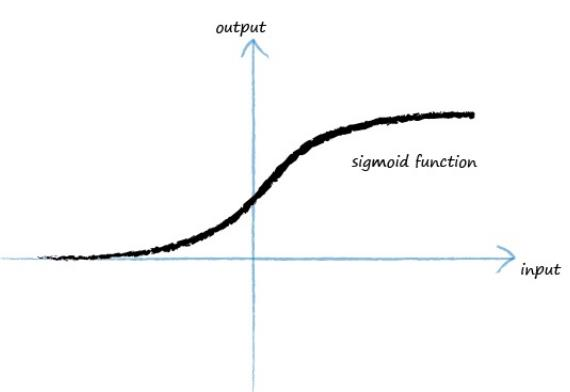

Sigmoid function (logistic function) :

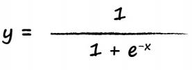

- x - input number is negated
- e - a mathematrical constant 2.71828

> The letter e is a mathematical constant 2.71828… It’s a very interesting number that pops up in all sorts of areas of mathematics and physics, and the reason I’ve used the dots … is because the decimal digits keep going on forever. Numbers like that have a fancy name, transcendental numbers. That’s all very well and fun, but for our purposes you can just think of it as 2.71828.

When **x** is zero, **e＾(-x)** is 1 because anything raised to a power of zero is 1.

So y = 1 / (1 +1 ) or simply 1/2, a half. 

So the basic sigmoid cuts the y-axis at y = 1/2.

**Reason for chooing this Sigmoid function :**

This sigmoid function is much easier to do calculations with than other S-shaped functions.

## **5. Model an Artificial Neuron**

The first thing to realize is that real biological neurons take many inputs, not just one. We saw this when we had two inputs to the Boolean logic machine, so the idea of having more than one input is not new or unusual.

What do we do with all these inputs? We simply combine them by adding them up, and the resultant sum is the input to the sigmoid function which controls the output. This reflects how real neurons work.

Illustration:

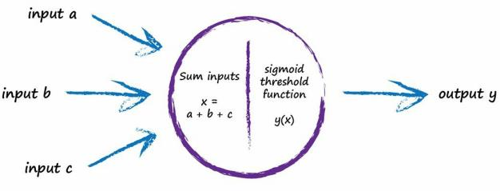

- If the combined signal is not large enough then the effect of the sigmoid threshold function is to suppress the output signal.

- If the sum x if large enough the effect of the sigmoid is to fire the neuron.

Interestingly, if only one of the several inputs is large and the rest small, this may be enough to fire the neuron. What’s more, the neuron can fire if some of the inputs are individually almost, but not quite, large enough because when combined the signal is large enough to overcome the threshold. In an intuitive way, this gives you a sense of the more sophisticated, and in a sense fuzzy, calculations that such neurons can do.

The electrical signals are collected by the dendrites and these combine to form a stronger electrical signal. If the signal is strong enough to pass the threshold, the neuron fires a signal down the axon towards the terminals to pass onto the next neuron’s dendrites. 

## **6. Primary Layers of Neurons**

The following diagram shows several neurons connected in this way:

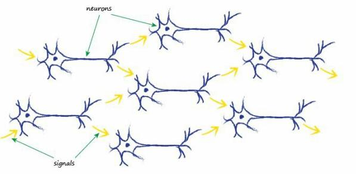

The thing to notice is that each neuron takes input from many before it, and also provides signals to many more, if it happens to be firing.

One way to replicate this from nature to an artificial model is to have layers of neurons, with each connected to every other one in the preceding and subsequent layer. 

The following diagram illustrates this idea:

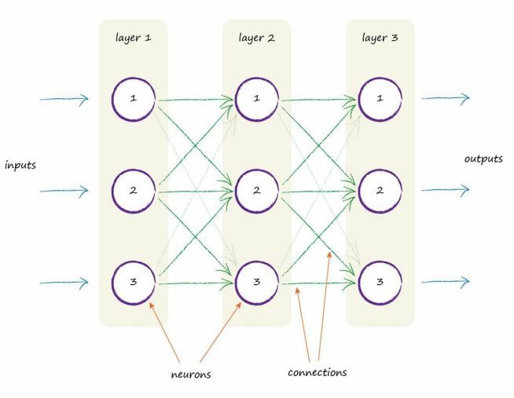

- Three layers : each with three artificial neurons, or **nodes.**

- Each node connected to every other node in the preceding and next layers.

The most obvious thing is to **adjust the strength of the connections between nodes**. 

**Within a node, we could have adjusted the summation of the inputs, or we could have adjusted the shape of the sigmoid threshold function, but that’s more complicated than simply adjusting the strength of the connections between the nodes.**

## **7. Layers of Neurons with Weight**

The following diagram again shows the connected nodes, but this time a **weight** is shown associated with each connection. 

A low weight will de-emphasize a signal, and a high weight will amplify it.

It s worth explaining the funny little numbers next to the weight symbols. The weight **w2,3** is simply the weight associated with the signal that passed between node 2 in a layer to node 3 in the next layer. So **w1,2** is the weight that diminishes or amplifies the signal between node 1 and node 2 in the next layer. To illustrate the idea, the following diagram shows these two connections between the first and second layer highlighted.

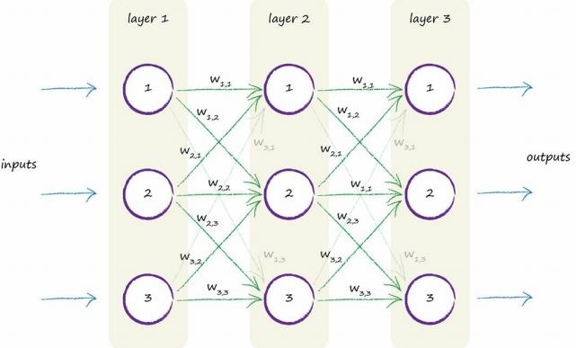

You might reasonably challenge this design and ask yourself why each node should connect to every other node in the previous and next layer. They don’t have to and you could connect them in all sorts of creative ways. We don’t because the uniformity of this full connectivity is actually easier to encode as computer instructions, and because there shouldn’t be any big harm in having a few more connections than the absolute minimum that might be needed for solving a specific task. The learning process will de-emphasise those few extra connections if they aren’t actually needed.

What do we mean by this? It means that as the network learns to improve its outputs by refining the link weights inside the network, some weights become zero or close to zero. Zero, or almost zero, weights means those links don’t contribute to the network because signals don’t pass. A zero weight means the signals are multiplied by zero, which results in zero, so the link is effectively broken.

##　**8. Key Points**

- Biological brains seem to perform sophisticated tasks like flight,finding food, learning language, and evading predators, despite appearing to have much less storage, and running much slower, than modern computers.

- Biological brains are also incredibly resilient to damage and imperfect signals compared to traditional computer systems.

- Biological brains, made of connected neurons, are the inspiration for artificial neural networks

- Natural brains can do sophisticated things, and are incredibly resilient to damage and imperfect signals...Unlike traditional computing.

- Trying to copy biological brains partly inspired artificial neural networks.

- Link weights are the adjustable parameter - it's where the learning happens.