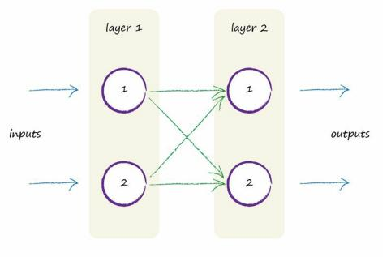
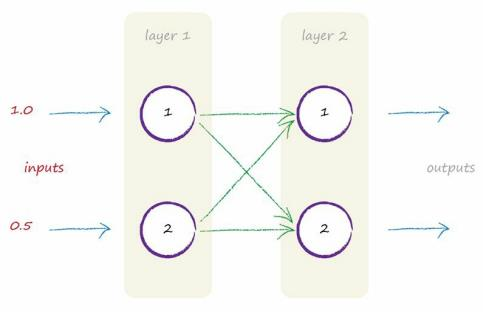
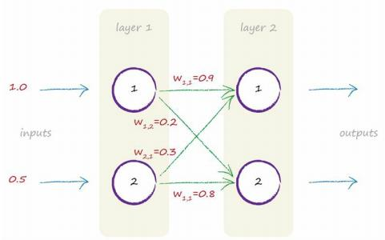
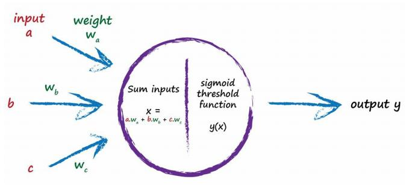
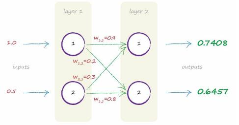

# Following Signals Through A Neural Network

[toc]

### 2 Lyaers - 2 Neurons Neural Network

#### I. Inputs

Imagine the two inputs are 1.0 and 0.5. 

Each node turns the sum of the inputs into an output using an activation function - sigmoid function.

#### II. Sigmoid Function

$$
y=\frac{1}{1+e^{-x}}
$$

- x : the sum of incoming signals to a neuron
- y : the output of thatneuron

#### III. Weights

 starts with some random weights

- $W_{1,1} = 0.9$
- $W_{1,2} = 0.2$
- $W_{2,1}=0.3$
- $W_{2,2}=0.8$

Four weights in this small neural network:

- Layer 1: no calculations to be done there
- Layer 2 : need to do some calculations
  - sigmoid function : $y=\frac{1}{1+e^{-x}}$
  - x : the combined input into a node

#### IV. Calculate the Output

That combination was the raw outputs from the connected nodes in the previous layer, but moderated by the link weights.

- For node 1 in the layer 2:

  Both nodes in the first input layer are connected to it. 

  Those input nodes have raw values of 1.0 and 0.5. 

  The link from the first node has a weight of 0.9 associated with it. 

  The link from the second has a weight of 0.3. 

  - the combined moderated x input is: 
    $$
    \begin{align}
    x & = (output \quad from \quad  first \quad  node * link \quad  weight) + (output \quad  from \quad  second \quad  node * link \quad  weight)\\ 
    & = (1.0 * 0.9) + (0.5 * 0.3)\\
    & = 0.9 + 0.15\\
    & = 1.05
    \end{align}
    $$

  - output using the activation function :
    $$
    \begin{align}
    y &=\frac{1}{1+e^{-x}}\\
    & = 1/(1+0.3499)\\
    & = 1/1.3499\\
    & = 0.7408
    \end{align}
    $$

- For remaining node 2 in the layer 2:

  - the combined moderated input x is :
    $$
    \begin{align}
    x & = (output \quad from \quad  first \quad  node * link \quad  weight) + (output \quad  from \quad  second \quad  node * link \quad  weight)\\ 
    & = (1.0 * 0.2) + (0.5 * 0.8)\\
    & = 0.2 + 0.4\\
    & = 0.6
    \end{align}
    $$

  - output using the activation function :
    $$
    \begin{align}
    y &=\frac{1}{1+e^{-x}}\\
    & = 1/(1+0.5488)\\
    & = 1/1.5488\\
    & = 0.6457
    \end{align}
    $$

Result:

