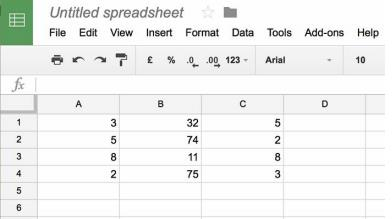
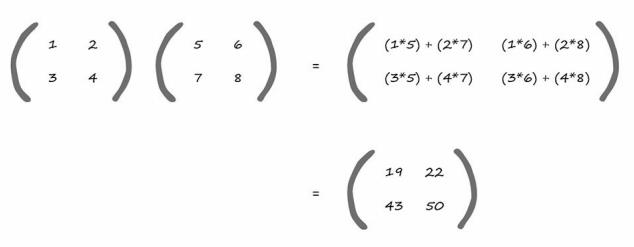
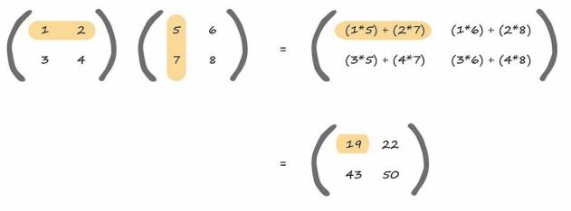
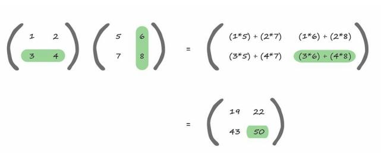
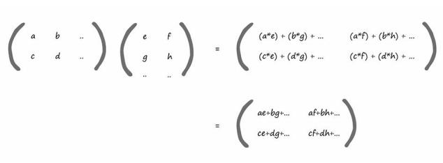
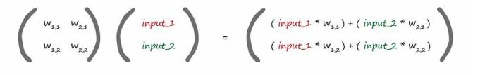
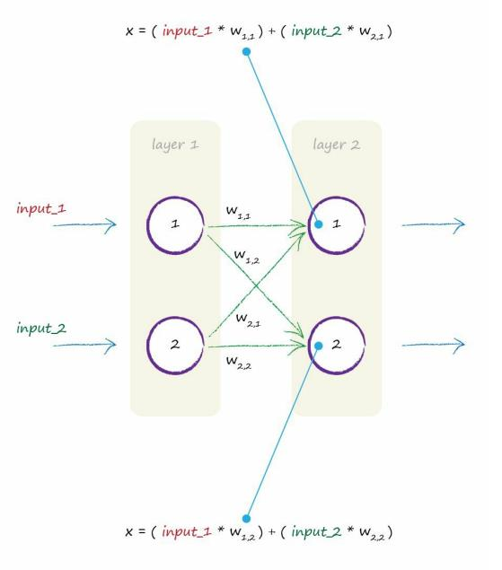

# Matrix

[toc]

### Introduction

A **matrix** is just a table, a rectangular grid, of numbers. 

That’s it. There’s nothing much more complex about a matrix than that. 

If you’ve used spreadsheets, you’re already comfortable with working with numbers arranged in a grid. 

Some would call it a table. 

We can call it a matrix too. 

The following shows a spreadsheet with a table of numbers

That’s all a matrix is - a table or a grid of numbers - just like the following example of a matrix of size “2 by 3”. 
$$
\begin{pmatrix}
23 & 43 & 22\\\\
43 & 12 & 54
\end{pmatrix}
$$
Also, some people use square brackets around matrices, and others use round brackets like we have. 

Actually, they don’t have to be numbers, they could be quantities which we give a name to, but may not have assigned an actual numerical value to. 

So the following is a matrix, where each element is a **variable** which has a meaning and could have a numerical value, but we just haven’t said what it is yet.

$$
\begin{pmatrix}
longitude \quad of \quad ship & \quad\quad longitude \quad of \quad plane\\\\
longitude \quad of \quad ship & \quad\quad longitude \quad of \quad plane
\end{pmatrix}
$$

### Multiplication

- Dot Product (Inner Product)
  - format : $ [m \ X \ n] \cdot [n \ X \ l]= [m \ X \ l]$ 

### Matrix Get Back In Neuron Network

- 1st. matrix : contains the weights between nodes of two layers.
- 2nd. matrix : contains the signals of the first input layer.

1st. node has the first input_1 moderated by the weight $w_{1,1}$ added to the second input_2 moderated by the $w_{2,1}$. 

These are the values of x before the sigmoid activation function is applied.

This really very useful!

Why? Because we can express all the calculations that go into working out the combined moderated signal, x , into each node of the second layer using matrix multiplication.

And this can be expressed as concisely as:
$$
X = W \cdot I
$$

- **W** : the matrix of weights
- **I** : the matrix of inputs
- **X** : the resultant matrix of combined moderated signals into layer 2.

We can simpy write $W\cdot I$ even if I has 2 elements or 200 elements.

## Activation Function - Sigmoid(X)

- doesn't need matrix multiplication.
- need to apply the sigmoid function $y=\frac{1}{1+e^{-x}}$ to each individual element of the matrix X.

## The final output

The final output from the second layer is :
$$
O = sigmoid(X)
$$

- **O** : the matrix of outputs from the final layer of the neural network.

The expression $X = W·I$ applies to the calculations between one layer and the next. 

If we have 3 layers, for example, we simply do the matrix multiplication again, using the outputs of the second layer as inputs to the third layer but of course combined and moderated using more weights. 

## Key Points

- The many calculations needed to feed a signal forward through a neural network can be expressed as **matrix multiplication**.
- Expressing it as matrix multiplication makes it much more **concise** for us to write, no matter the size of neural network.
- More importantly, some computer programming languages understand matrix calculations, and recognise that the underlying calculations are very similar. This allows them to do these calculations more **efficiently** and quickly.