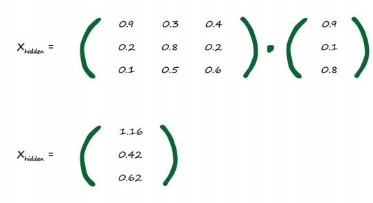

# A Three Layer Example with Matrix Multiplication

[toc]

## 3 Layers - 3 Nodes Neural Network

The following diagram shows an example neural network with 3 layers, each with 3 nodes.

To keep the diagram clear,not all the weights are marked.

###　Terminology

- **Input Layer 1 :** the first layer
- **Hidden Layer 2 :** the middle layer
- **Output Layer 3 :** the final layer

### Illustration 

- the combined and moderated inputs into this middle layer are 
  $$
  X = W \cdot I
  $$

  - **I** : the matrix of input signals

  - **W** : the matrix of weights

    

#### Input Layer 1

- Inputs : 0.9 、0.1 and 0.8.
  $$
  I = 
  
  \begin{pmatrix}
  & 0.9 & \\
  & 0.1 & \\
  & 0.8 & \\
  \end{pmatrix}
  $$
  

#### Hidden Layer 2

- need to work out the combined and moderated signals to each node in this middle layer.
- each node in this middle hidden layer is connected to by every node in the input layer, so it gets some portion of each input signal.

- made up the weights between the input and hidden layers：
  $$
  W_{input\_hidden} = 
  
  \begin{pmatrix}
  & 0.9 & 0.3 & 0.4 & \\
  & 0.2 & 0.8 & 0.2 & \\
  & 0.1 & 0.5 & 0.6 & \\
  \end{pmatrix}
  $$

   - $w_{1,1} = 0.9, \quad w_{1,2} = 0.2, \quad w_{1,3} = 0.1$
   - $w_{2,1} = 0.3, \quad w_{2,2} = 0.8, \quad w_{3,3} = 0.5$
   - $w_{3,1} = 0.1,\quad w_{3,2} = 0.5,\quad w_{3,3}=0.6$

 - the combined moderated input into the hidden layer:
   $$
   X_{hidden}=W_{input\_hidden}\cdot I
   $$
   

- Output in hidden layer $O_{hidden}$ :

  sigmoid activation function : 

$$
O_{hidden} = sigmoid(X_{hidden})
$$

​	the sigmoid function is applied to each element in $X_{hidden}$ to produce 

​	the matrix which has the output of the  middle hidden layer.

Let's just check the first element to be sure.

The sigmoid function is $y = \frac{1}{1+e^{-x}}$, so when x = 1.16, $e^{-1.16} = 0.3135$

So $y = 1/(1+0.3135) = 0.761$.

All the values are between 0 and 1, because this sigmoid doesn’t produce values outside that range. 

Look back at the graph of the logistic function to see this visually.

#### Output Layer 3

- made up the weights randomly between the hidden and output layers:
  $$
  W_{hidden\_output} = 
  
  \begin{pmatrix}
  & 0.3 & 0.7 & 0.5 & \\
  & 0.6 & 0.5 & 0.2 & \\
  & 0.8 & 0.1 & 0.9 & \\
  \end{pmatrix}
  $$

  - $w_{1,1} = 0.3, \quad w_{1,2} = 0.6, \quad w_{1,3} = 0.8$
  - $w_{2,1} = 0.7, \quad w_{2,2} = 0.5, \quad w_{3,3} = 0.1$
  - $w_{3,1} = 0.5,\quad w_{3,2} = 0.2,\quad w_{3,3}=0.9$

- the inputs into this layer are the outpus from the second layer we just worker out $O_{hidden}$

$$
X_{output}=W_{hidden\_output}\cdot O_{hidden}
$$

- All that remains is to apply the sigmoid activation function:

#### Final Output of the Example Neural Network

So the final output of the example neural network with three layers is 0.726, 0.708 and 0.778. 

