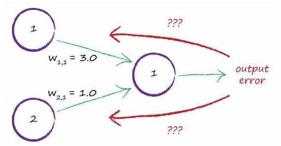
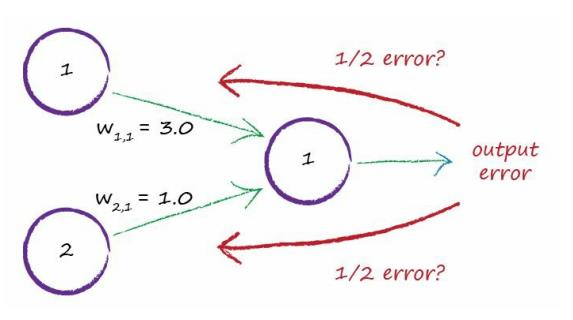
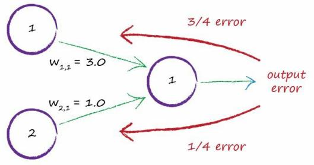

# Learning Weights From More Than One Node

[toc]

## Review Refined a Simple Linear Classifier

Previously we refined a simple linear classifier by adjusting the slope 

parameter of the node’s linear function. 

We used the error, the difference between what the node produced as an 

answer and what we know the answer should be, to guide that refinement. 

That turned out to be quite easy because the relationship between the error 

and the necessary slope adjustment was very simple to work out. 

## Update Link Weights in Neuron Network

How do we update link weights when more than one node contributes to an output and its error?

> 
>
> Things were much simpler when we just had one node feeding into an output node. If we have two nodes, how do we use that output error?
>
> It doesn’t make sense to use all the error to update only one weight, because that ignores the other link and its weight. That error was there because more than one link contributed to it.
>
> There is a tiny chance that only one link of many was responsible for the error, but that chance is extremely miniscule. If we did change a weight that was already “correct”, making it worse, it would get improved during the next iterations so all is not lost.
>
> 

- One idea is to split the error equally amongst all contributing nodes, as shown next.

That is not a bad idea at all. Although I haven’t tried it in real neural networks, I’m sure it wouldn’t work too badly at all.

- Another idea is to split the error but not to do it equally.

  Instead we give more of the error to those contributing connections which bad greater link weights.

  Why?

  `Because they contributed more to the error.`

  

  

  > 
  >
  > Here there are two nodes contributing a signal to the output node. 
  >
  > The link weights are 3.0 and 1.0. 
  >
  > If we split the error in a way that is proportionate to these weights, we can see that $\frac{3}{4}$  of the output error should be used to update the first larger weight, and that $\frac{1}{4}$ of the error for the second smaller weight. 
  >
  > We can extend this same idea to many more nodes. If we had 100 nodes connected to an output node, we’d split the error across the 100 connections to that output node in **proportion** to each link’s contribution to the error, indicated by the size of the link’s weight.
  >
  > 

## Backpropagation

You can see that we’re using the weights in two ways. 

- Firstly we use the weights to propagate signals forward from the input to the output layers in a neural network. We worked on this extensively before. 
- Secondly we use the weights to propagate the error backwards from the output back into the network. You won’t be surprised why the method is called **backpropagation**.

If the output layer had 2 nodes, we’d do the same for the second output node. 

That second output node will have it’s own error, which is similarly split across the connecting links. 