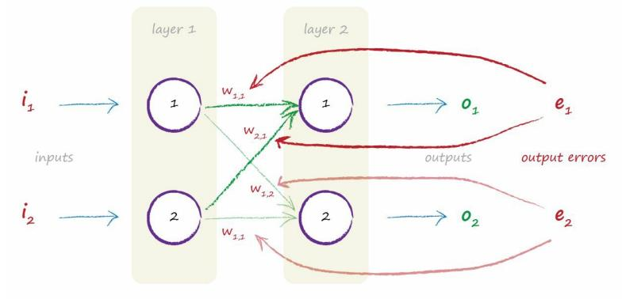

# Backpropagating Errors From More Output Nodes

[toc]

## A Simple Network Example

The following diagram shows a simple network with 2 input nodes,but now with 2 output nodes.

## The Fraction of Error Used to Refine Weights

- $e_1 = t_1 - o_1$

  the fraction of $e_1$ used to refine $w_{11}$ is
  $$
  \frac{w_{11}}{w_{11}+w_{21}}
  $$
  the fraction of $e_1$ used to refine $w_{21}$ is
  $$
  \frac{w_{21}}{w_{11}+w_{21}}
  $$

  >
  >
  >If $w_{11}$ is twice as large as $w_{21}$, say $w_{11} = 6$ and $w_{21}=3$,then the fraction of $e_1$ used to refine $w_{11}$ is 6/(6+3)=6/9=2/3. 
  >
  >That should leave 1/3 of $e_1$ for the other smaller weight $w_{21}$ which we can confirm using the expression 3/(6+3) = 3/9 = 1/3 
  >
  >If the weights were equal, the fractions will both be half, as you’d expect. 
  >
  >Let’s see this just to be sure. Let’s say $w_11$=4 and $w21$=4, then the fraction is 4/(4+4) = 4/8 = 1/2 for both cases. 
  >
  >

- $e_2 = t_2 - o_2$

  the fraction of $e_2$ used to refine $w_{12}$ is 
  $$
  \frac{w_{12}}{w_{12}+w_{22}}
  $$
  the fraction of $e_2$ used to refine $w_{12}$ is 

$$
\frac{w_{22}}{w_{12}+w_{22}}
$$

