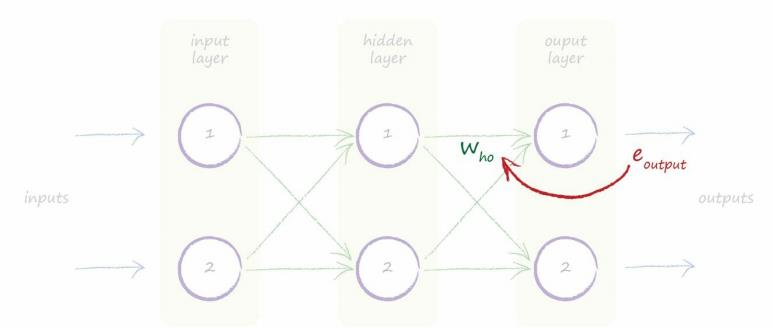
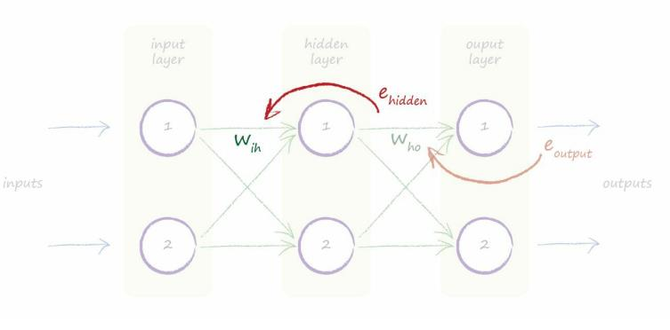
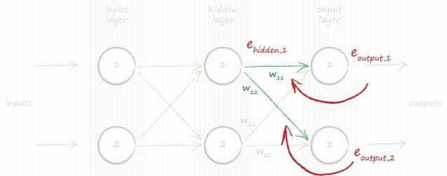
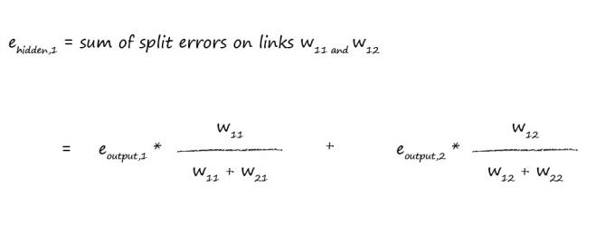
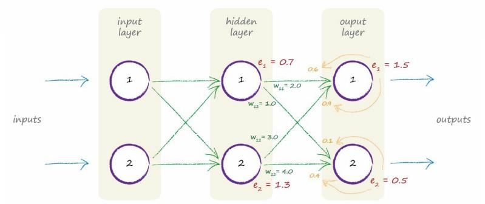
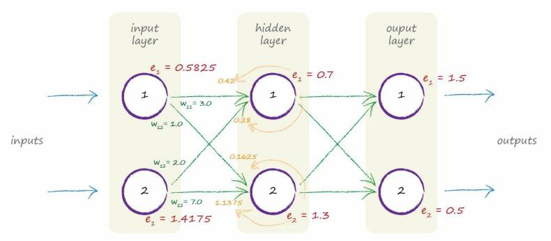

# Backpropagating Errors To More Layers

[toc]

## Error Backpropagation

The following diagram shows a simple neural network with 3 layers, an input layer, a hidden layer and the final output layer. 

- $e_{output}$ : the output errors

- $w_{ho}$: the weights of the links between the hidden and output layer

  

- $e_{hidden}$ : errors associated with the output of the hiden layer nodes

- $w_{hi}$ : split those again proportionately across the preceding links between the input and hidden layers

  

If we had even more layers, we’d repeatedly apply this same idea to each layer working backwards from the final output layer.

The flow of error information makes intuitive sense.

This is why called error **backpropagation**.

## Error in Hidden Layer

 

> 
>
> But how do we work out the error in hidden layer? **We don’t have the target or desired outputs for the hidden nodes.** We only have the target values for the final output layer nodes, and these come from the training examples. 
>
> 

That first node in the hidden layer has two links emerging from it to connect it to the two output layer nodes. 

We know we can split the output error along each of these links, just as we did before. 

That means we have some kind of error for each of the two links that emerge from this middle layer node.

We could recombine these two link errors to form the error for this node as a second best approach because we don’t actually have a target value for the middle layer node. 

The following shows this idea visually.

We need an error for the hidden layer nodes so we can use it to update the weights in the preceding layer. 

We call these $e_{hidden}$. 

But we don’t have an obvious answer to what they actually are. 

We can’t say the error is the difference between the desired target output from those nodes and the actual outputs, because our training data examples only give us targets for the very final output nodes.

**The training data examples only tell us what the outputs from the very final nodes should be. They don’t tell us what the outputs from nodes in any other layer should be.** This is the core of the puzzle. 

## Solution

We could recombine the split errors for the links using the error backpropagation we just saw earlier. 

So the error in the first hidden node is the sum of the split errors in all the links connecting forward from same node. 

In the diagram above, we have a fraction of the output error $e_{output,1}$ on the link with weight $w_{11}$ and also a fraction of the output error $e_{output,2}$ from the second output node on the link with weight $w_{12}$.

$$
\begin{align}
e_{hiddene,1} & = e_{output,1} * \frac{w_{11}} {w_{11}+w_{21}} + e_{output,2} * \frac{w_{12}} {{w_{12}+w_{22}}} \\
& = 0.6 + 0.1\\
& = 0.7 \\ \\

e_{hiddene,2} & = e_{output,1} * \frac{w_{21}} {w_{11}+w_{21}} + e_{output,2} * \frac{w_{22}} {{w_{12}+w_{22}}} \\
& = 0.9 + 0.4\\
& = 1.3

\end{align}
$$

The next diagram shows the same idea applied to the preceding layer, working further back.

## Key Points

- Neural networks learn by refining their link weights. This is guided by the **error** - the difference between the right answer given by the training data and their actual output. 
- The error at the output nodes is simply the difference between the desired and actual output. 
- However the error associated with internal nodes is not obvious. One popular approach is to split the output layer errors in **proportion** to the size of the connected link weights, and then recombine these bits at each internal node.