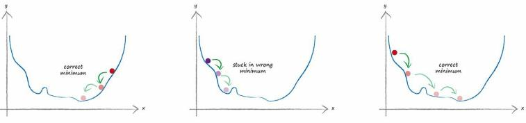

# Gradient Descent

[toc]

## Brute Force Method

- The error is used to guide how we adjust the link weights to improve the overall answer given by the neural network.

- The input at node i is $x_i$.

- The weights for links connecting input node i to hidden node j is $w_{i,j}$.

- The output of hidden node j is $x_j$.

- The weights for links connecting hidden node j to output node k is $w_{j,k}$.

- Brute Force Method :$\sum{a^b}$ : sum the subsequent expression for all values between a and b.

  

## Pessimism

The first thing we must do is embrace **pessimism**. 

Pessimism Reasons :

- The mathematical expressions showing how all the weights result in a neural network’s output are too complex to easily untangle. 
- The weight combinations are too many to test one by one to find the best. 
- The training data might not be sufficient to properly teach a network. The training data might have errors so our assumption that it is the perfect truth, something to learn from, is then flawed. The network itself might not have enough layers or nodes to model the right solution to the problem. 

So we must take an approach that is realistic, and recognise these limitations. If we do that, we might find an approach which isn’t mathematically perfect but does actually give us better results because it doesn’t make false idealistic assumptions. 

## **Gradient Descent**

Imagine a very complex landscape with peaks and troughs, and hills with treacherous bumps and gaps. 

It’s dark and you can’t see anything. 

You know you’re on the side of a hill and you need to get to the bottom. You don’t have an accurate map of the entire landscape. You do have a torch. 

What do you do? 

You’ll probably use the torch to look at the area close to your feet. You can’t use it to see much further anyway, and certainly not the entire landscape. 

You can see which bit of earth seems to be going downhill and take small steps in that direction. 

In this way, you slowly work your way down the hill, step by step, without having a full map and without having worked out a journey beforehand

The mathematical version of this approach is called **gradient descent**.

After you’ve taken a step, you look again at the surrounding area to see which direction takes you closer to your objective, and then you step again in that direction. You keep doing this until you’re happy you’ve arrived at the bottom. The gradient refers to the slope of the ground. You step in the direction where the slope is steepest downwards 

Now imagine that complex landscape is a mathematical function. What this gradient descent method gives us is an ability to find the minimum without actually having to understand that complex function enough to work it out mathematically. If a function is so difficult that we can’t easily find the minimum using algebra, we can use this method instead. Sure it might not give us the exact answer because we’re using steps to approach an answer, improving our position bit by bit. But that is better than not having an answer at all. Anyway, we can keep refining the answer with ever smaller steps towards the actual minimum, until we’re happy with the accuracy we’ve achieved.

## The Link between Gradient Descent Method and Neural Networks

If the complex difficult function is the error of the network, then going downhill to find the minimum means we are minimizing the error. We re improving the network s output. 

$y = (x-1)^2+1$ 

If this was a function where y was the error,we would want to find the x which minimal se t.

### 1st. Case : Negative Slope

The graph shows our randomly chosen starting point. Like the hill climber, we look around the place we’re standing and see which direction is downwards. 

The slope is marked on the graph and in this case is a negative gradient. We want to follow the downward direction so we move along x to the right. That is, we increase x a little. That’s our hill climber’s first step. You can see that we’ve improved our position and moved closer to the actual minimum. 

### 2nd. Case : Positive Slope

This time, the slope beneath our feet is positive, so we move to the left. That is, we decrease **x** a little. Again you can see we’ve improved our position by moving closer to the actual true minimum. We can keep doing this until our improvements are so small that we can be satisfied that we’ve arrived at the minimum. 

### Discontinuities : Moderating Step Size

A necessary refinement is to change the size of the steps we take to avoid overshooting the minimum and forever bouncing around it. 

You can imagine that if we’ve arrived 0.5 meters from the true minimum but can only take 2 meters steps then we’re going to keep missing the minimum as every step we take in the direction of the minimum will overshoot. 

If we moderate the step size so it is proportionate to the size of the gradient then when we are close we’ll take smaller steps. 

This assumes that as we get closer to a minimum the slope does indeed get shallower. 

That’s not a bad assumption at all for most smooth continuous functions. It wouldn’t be a good assumption for crazy zig-zag functions with jumps and gaps, which mathematicians call **discontinuities**. 

### Get the True Minimum

- **Notice : increase x in the opposite direction to the gradient.**

  A positive gradient means we reduce x. 

  A negative gradient means we increase x.

- This method really shines when we have functions of many parameters. So not just y depending on x, but maybe y depending on a, b, c, d, e and f. Remember the output function, and therefore the error function, of a neural network depends on many many weight parameters. 

## Gradient Descent Get Stuck in the Wrong Valley

Looking at that 3-dimensional surface and wondering whether gradient descent ends up in that other valley also shown at the right. 

In fact, thinking more generally, doesn’t gradient descent sometimes get stuck in the wrong valley, because some complex functions will have many valleys? What’s the wrong valley?

It’s a valley which isn’t the lowest. The answer to this is yes, that can happen. 

### Avoid in the Wrong Valley

- To avoid ending up in the wrong valley, or function **minimum**
  - We train neural networks several times starting from different points on the hill to ensure we don’t always ending up in the wrong valley. 
  - Different starting points means choosing different starting parameters, and in the case of neural networks this means choosing different starting link weights. 
- Three different goes at gradient descent

## Key Points

- **Gradient descent** is a really good way of working out the minimum of a function, and it really works well when that function is so complex and difficult that we couldn’t easily work it out mathematically using algebra. 
- What’s more, the method still works well when there are many parameters, something that causes other methods to fail or become impractical. 
- This method is also **resilient** to imperfections in the data, we don’t go wildly wrong if the function isn’t quite perfectly described or we accidentally take a wrong step occasionally. 