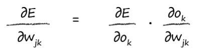

# Work Out the Right Weights by Gradient Descent

[toc]

## Pick the Right Error Function

The output function of a neural network itself isn’t an error function. 

But we know we can turn it into one easily, because the error is the difference between the target training values and the actual output values. 

- $Error = target - actual$

   

  Clearly the network isn’t perfectly trained because the first two node outputs are different to the target values. 

  **The sum of zero suggests there is no error. This happens because the positive and negative errors cancel each other out.** 

  **Even if they didn’t cancel out completely, you can see this is a bad measure of error.** 

- $Error = |target - actual|$

  The **absolute** value of the difference. That means ignoring the sign. 

  That could work, because **nothing can ever cancel out**. 

  The reason **this isn’t popular is because the slope isn’t continuous near the minimum and this makes gradient descent not work so well, because we can bounce around the V-shaped valley that this error function has. The slope doesn’t get smaller closer to the minimum, so our steps don’t get smaller, which means they risk overshooting**

- $Error = (target - actual)^2$ (Prefer!) 

  The reasons for picking this function as error function:

  - **The algebra needed to work out the slope for gradient descent is easy enough with this squared error.** 
  - **The error function is smooth and continuous making gradient descent work well - there are no gaps or abrupt jumps.** 
  - **The gradient gets smaller nearer the minimum, meaning the risk of overshooting the objective gets smaller if we use it to moderate the step sizes.**

## Work Out the Slope of the Error Function With Respect to the Weights.

- Requires $Calculus$

  >
  >
  >Calculus is simply a mathematically precise way of working out how something changes when something else does.
  >
  >For example, how the length of a spring changes as the force used to stretch it changes.
  >
  >
  >
  
- Question:

  Here we’re interested in how the error function depends on the link weights inside a neural network. 

  Another way of asking this is - “how sensitive is the error is to changes in the link weights?”

- The graph is just like the one we saw before to emphasize that we’re not doing anything different. This time the function we’re trying to minimize is the neural network’s error. The parameter we’re trying to refine is a network link weight. 

  

- The next diagram shows two link weights, and this time the error function is a 3 dimensional surface which varies as the two link weights vary.

  

- Use gradient descent to find the minimum : 

  - Mathematically :

  

  Means:
  
  - How does the error E change as the weight $w_{jk}$ changes. 
  
  - That’s the slope of the error function that we want to descend towards the minimum.

### Analyze

Focus only on the link weights between the hidden and the final output layers.

#### 1st. step : expand that error function

- the sum of the differences between the target and actual values squared, and where that sum is over all the n output nodes. 
- write out what the error function E actually is.

#### 2st. step : removes that pesky sum totally

> 
>
> We can simplify this straight away by noticing that the output at a node n which is $o_n$, only depends on the links that connect to it. 
>
> That means for a node $k$, the output $o_k$ only depends on weights $w_{jk}$, because those weights are for links into node $k$. 
>
> Another way of looking at this is that the output of a node $k$ does not depend on weights $w_{jb}$, where $b$ does not equal $k$, because there is no link connecting them.
>
> The weight $w_{jb}$ is for a link connecting to output node $b$ not $k$.
>
> This means we can remove all the $o_n$ from that sum except the one that the weight $w_{jk}$ links to, that is $o_k$. 
>
> This removes that pesky sum totally!
>
> 

- The reason is that **the output of a node only depends on the connected links and hence their weights.** 
- Expression:

#### 3rd. step : omit $t_k$

> 
>
> That $t_k$ part is a constant, and so doesn’t vary as $w_{jk}$ varies. 
>
> That is $t_k$ isn’t a function of $w_{jk}$.
>
> Because the target values did change depending on the weights.
>
> That leaves the $o_k$ part which we know does depend on $w_{jk}$ because the weights are used to feed forward the signal to become the outputs $o_k$.
>
> 

- The reason is that **the target values did change depending on the weights**.

#### 4th. : use the chain rule to break apart this differentiation task into more manageable pieces.

- Expression :

#### 5th. step : attack each simpler bit in turn

- first bit:

  

- second bit:

  > 
  >
  >That $o_k$ is the output of the node k which, if you remember, is the sigmoid function applied to the weighted sum of the connected incoming signals.
  >
  >That $o_j$ is the output from the previous hidden layer node, not the output from the final layer $o_k$.
  >
  >

  

#### 6th. step : differentiate the sigmoid function

> 
>
> Others have already done.
>
> Just use the well known answer.
>
> 

#### 7th. step : apply this cool result

>
>
>The extra last bit :
>
>- It’s the chain rule again applied to the sigmoid derivative because the expression inside the sigmoid() function also needs to be differentiated with respect to $w_{jk}$. 
>
>- That too is easy and the answer is simply $o_j$.
>
>

#### 8th. step : get the final answer

- get rid of that 2 at the fron

  > 
  >
  > - Because we’re only interested in the direction of the slope of the error function so we can descend it. 
  >
  > - It doesn’t matter if there is a constant factor of 2, 3 or even 100 in front of that expression, as long we’re consistent about which one we stick to. 
  >
  >   

- final answer

  

#### 9th. step : second look

- The first part is simply the (target - actual) error.
- The sum expression inside the sigmoids is simply the signal into the final layer node, we could have called it $i_k$ to make is look simpler. It’s just the signal into a node before the activation squashing function is applied.
- That last part is the output from the previous hidden layer node j.

#### 10th. setp : Rebuild an Expression for the New Set of Weights

- The first part which was the (target - actual) error now becomes the recombined back-propagated error out of the hidden nodes, just as we saw above. Let’s call that $e_j$.
- The sigmoid parts can stay the same, but the sum expressions inside refer to the preceding layers, so the sum is over all the inputs moderated by the weights into a hidden node j. We could call this $i_j$. 
- The last part is now the output of the first layer of nodes **oi**, which happen to be the input signals. 

This nifty way of avoiding lots of work, is simply taking advantage of the symmetry in the problem to construct a new expression.We say it’s simple but it is a very powerful technique, wielded by some of the most big-brained mathematicians and scientists.

So the second part of the final answer we’ve been striving towards is as follows, the slope of the error function for the weights between the input and hidden layers. 

## Update the Weights after Each Training Example

- Remember the weights are changed in a direction opposite to the gradient, as we saw clearly in the diagrams earlier.

>  We also moderate the change by using a learning factor, which we can tune for a particular problem. We saw this too when we developed linear classifiers as a way to avoid being pulled too far wrong by bad training examples, but also to ensure the weights don’t bounce around a minimum by constantly overshooting it.

- Update the weights
  - $w_{jk}$ : the old weight adjusted by the negative of the error slope we just worked out.It’s negative because we want to increase the weight if we have a positive slope, and decrease it if we have a negative slope, as we saw earlier. 
  - $\alpha$(learning rate) :  a factor which moderates the strength of these changes to make sure we don’t overshoot. 

- Do them as matrix multiplications：

  

- $\alpha$(Learning Rate) : a constant
- $△w_{jk}$ :  the matrix of weight changes contains values which will adjust the weight $w_{j,k}$ linking node j in one layer with the node k in the next.
- ${O_j}^T$ :  the transpose of the outputs from the previous layer $O_j$

## Key Points

- A neural network’s error is a function of the internal link weights. 

- Improving a neural network means reducing this error - by changing those weights. 

- Choosing the right weights directly is too difficult. An alternative approach is to iteratively improve the weights by descending the error function, taking small steps. Each step is taken in the direction of the greatest downward slope from your current position. This is called **gradient descent**. 

- That error slope is possible to calculate using calculus that isn’t too difficult.