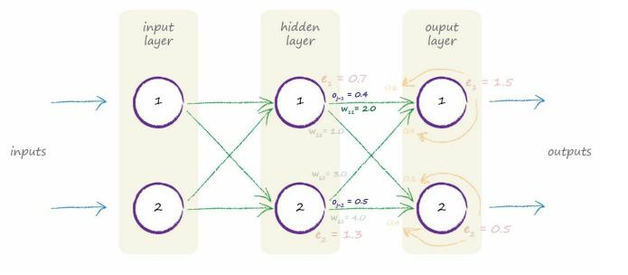

# Weight Update Worked Example

[toc]

### Calculation

#### $O_{j=1} = 0.4$

- 1st. step  : error

  

  $error = t_k - o_k$

  $e_1 = 1.5$

- 2nd. step : 

  - the sum inside the sigmoid functions

  

  $\sum _j w_{jk}o_j \\= (2.0 * 0.4) + (4.0 * 0.5) \\= 2.8$

  

  - do sigmoid

  $sigmoid( \sum _jw_{jk}o_j) \\ = 1/(1+e^{-2.8}) \\ = 0.943$

  
  - middle expression

  $sigmoid(\sum _jw_{jk}o_j) \cdot (1-sigmoid(\sum _jw_{jk}o_j))\\ = 0.943 * (1-0.943) \\ = 0.054$

- 4th. step : calcualte

  Multiplying all these three bits together and not forgetting the minus sign at the start gives us **-0.06048**???

  If we have a learning rate of 0.1 that give is a change of $- (0.1 * - 0.06048) = + 0.006.$ 

  So the new $w_11$ is the original 2.0 plus 0.006 = 2.006.
  
  
  
  This is quite a small change, but over many hundreds or thousands of iterations the weights will eventually settle down to a configuration so that the well trained neural network produces outputs that reflect the training examples.

  